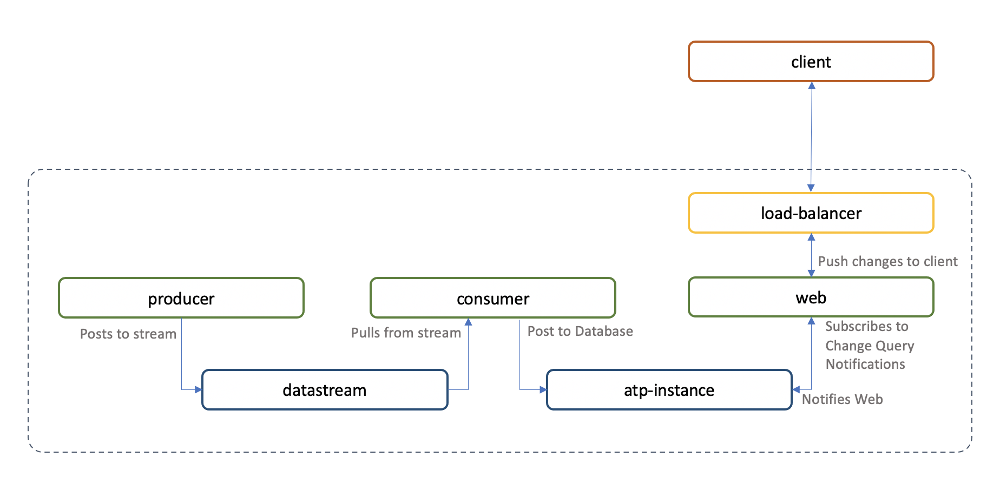

# App development boilerplate for OKE with Autonomous Database and Streaming

This is a template repository with a working demo project to showcase building a micro-services-based application in a remote cluster environment.

The OCI Service Broker lets you provision PaaS services like Autonomous Database, Streaming or Object Storage via Kubernetes manifests. When working with those external PaaS services, it is difficult to simulate them in a local environment, so it is often required to develop in a remote cluster.

This repository provides tooling and an example application to manage such a development project on OKE, using underlying tools like Kustomize and Skaffold to develop, debug and deploy to production.

It lets you:

- Run a development deployment with live code sync with the container in the remote cluster.
- Run a debugger in the live container in the remote cluster.
- Manage image tags for dev (per branch), debug or production automatically, allowing deployment of uncommitted (dirty) changes to a dev environment, and tags based on commit hash for production.

## Example micro-service architecture

The core of this repository is to showcase a typical setup and workflow to develop, debug and deploy a micro-services architecture in a kubernetes remote cluster, using external PaaS services like Autonomous Database and Streaming.

The repository contains 3 services for demo purpose, however the tooling implemented is meant for any such type of project.



## How to use

Use this repository as a template by clicking the **Use this Template** button.

## Repository structure

The repository has the following structure:

```bash
├── README.md
├── global.env
├── makefile
├── makefile.common
├── makefile.python
├── terraform
|   └──
├── k8s
│   ├── base
│   └── overlays
│       ├── branch
│       ├── development
│       ├── production
│       └── staging
├── scripts/
└── images
    ├── consumer
    ├── producer
    ├── db-config
    └── web
```

- The `terraform` folder contains the terraform scripts to provision the credentials required to develop and deploy

    This includes:
    1. an OCI user with credentials to push Docker images to a tenancy-wide OCI private registry
    2. an OCI user with private key and API key to interact with an OKE cluster
    3. Since the project makes use of the Streaming service, it includes a user with credentials specific to this service.

    The terraform takes an existing OKE cluster OCID and creates the users and credentials, as well as `Secrets` in the base kubernetes manifests.

    If you do not have permission to create users, provide your user_ocid for each of the users.

- The `k8s` folder contains the kubernetes manifests to deploy the project. It is using `kustomize` with overlays to templatize for 3 environments: `development`, `staging` and `production`.

- The `scripts` folder contains scripts used for setup and for CI

- The `image` folder contains the demo application Docker source code for each service. In our example, that includes 3 services `consumer`, `producer` and `web`, as well as a database config initContainer `db-config`.

## Getting started

To get started, you'll need an OKE cluster deployed with OCI Service Broker.

See this repository to setup a production ready OKE cluster with OCI Service Broker: [https://github.com/oracle-quickstart/oke-with-service-broker](https://github.com/oracle-quickstart/oke-with-service-broker)

If your user is not privileged enough to deploy this repository, follow the instructions to provide your own user.

Once you have deployed an OKE cluster as per the above:

### Create additional user credentials using the terraform

- Go to the `terraform` folder.
- Create a `terraform.tfvars` file from the `terraform.tfvars.template`
- Edit the `terraform.tfvars` to provide:

    ```bash
    tenancy_ocid = "ocid1.tenancy.oc1.."
    compartment_ocid = "ocid1.compartment.oc1..."
    region           = "us-ashburn-1"

    # cluster ID of the cluster created with the oke-with-service-broker deployment
    cluster_id = "ocid1.cluster...."
    ```

- If you are an admin or privileged user to create new users, leave the other variables as `null`
- If you are not a privileged to create groups, provide the groups OCIDs with the proper policies to create the required users.
- If you are not privileged to create users, provide the proper user OCIDs of users that are in groups with proper policies. (Inspect the `main.tf` to see the users and policies required).

- If you do not have access to specific users for each task, you can use your own user (for testing/demo purpose only. This is not recommended for security reasons).
    1. Fill in each required `###_user_ocid`.
    2. If you already have any auth_token associated with this user, provide the token for each `###_auth_token` as you will not have enough open slots to create new tokens. You can use the token created during creation of the cluster with `oke-with-service-broker` if you supplied your own user when deploying and created a token.
    3. You also need to have at most 2 API keys associated with your user, or you should comment out the section in `main.tf` that creates the `ci_user` and requires the creation of an API key.

- Run `terraform init` then `terraform plan` and if all look right, run `terraform apply` (confirming with the `yes` to run the deployment)

## Tooling

The keys functions are integrated into a `makefile` that wraps many commands for ease of use.

### Application-wide makefile

The root folder includes a `makefile` to run application-wide functions. Run `make` on the root to get the help text:

```bash
help                           This help.
build                          Build, tag and push all images managed by skaffold
deploy                         Build and Deploy app templates
deploy-infra                   Build and Deploy infra templates
delete                         Delete the current stack
delete-infra                   Delete the current stack
setup                          Setup dependencies
render                         Render the manifests with skaffold and kustomize
check-render                   Check if the current render matches the saved rendered manifests
clean-completed-jobs           Clean completed Job. Skaffold can't update them and fails
clean-all-jobs                 Clean any Job. Skaffold can't update them and fails
run                            run the stack, rendering the manifests with skaffold and kustomize
debug                          run the stack in debug mode, rendering the manifests with skaffold and kustomize
dev                            run the stack in dev mode, rendering the manifests with skaffold and kustomize
install-all                    Install environments for all projects
lint-all                       Lint all python projects
repo-login                     Login to the registry
```

Since development tooling like Skaffold deploy and destroy the environment it manages when developping, the infrastructure services that need to be deployed once are deployed separately. The `deploy-infra` command deploys the kubernetes manifests for the infrastructure services in a given environment, passed as `ENVIRONMENT=<environment>` (either `development` (default), `staging`, or `production`)

You must deploy the infrastructure in a given environment before attempting to deploy the application.

The `build` and `deploy` commands build and deploy the kubernetes manifests for the application a given environment, passed as `ENVIRONMENT=<environment>` (either `development` (default), `staging`, or `production`)

### Service specific makefile

Each service folder also includes its own `makefile` for image specific tasks. Run `make` for the help text.

It specifically simplify some of the testing / linting tasks.

*Note: Skaffold manages all images together so this makefile is merely offered here for standalone development purpose.*

### Deploying the infrastructrue

The project is divided into 2 sub-project: the application and the supporting infrastructure (Autonomous Database and Streaming service). The infrastructure is deployed separately, so it is not deployed and torn down at each dev deployment.

Before deploying the infrastructure, make sure to generate a new set of passwords for those services, by running:

```bash
./scripts/gen_pwd.sh
```

To provision the infrastructure for the `dev` environment (the default), then use:

```bash
make deploy-infra
```

To deploy in another environment (for example `production`), use:

```bash
make deploy-infra ENVIRONMENT=production
```

### Deploying the application

To deploy in the dev environment, use

```bash
make deploy
```

This will build the application images, push them to the OCI Registry and deploy the application manifests to the production environment.


### Checking the app in the browser

1. Get the Public IP of the load balancer:

    ```bash
    kubectl get service -n dev-ns
    ```

    Get the EXTERNAL-IP

    In your browser, go to http://*EXTERNAL-IP/ to see the Demo sensor log app.

    If you scale the number of `producer` pods, you will see multiple streams of randomly generated data.
    The data is pushed to a stream, picked up by the consumer app and stored in the database. The web application gets notified of changes and uses server push to update the UI.

### Developping with Skaffold

To run the stack in development mode, which allows to stream the logs to the console, deploy uncommitted changes, and especially live update code files in the remote container use:

```bash
make dev
```

This will launch the Docker image using a specific layer that implements auto-reload for the code files, restarting the container in any code change. Image tags for the auto-relaod layer are prefixed with `arl-`

When working in a feature branch, this command will apply a suffix to the containers, so that multiple branch deployments can share the same infrastructure in the same namespace (the dev-ns namespace)

### Debugging containers in the remote cluster

Skaffold offers the capability to debug remote containers.

Use:

```bash
make debug
```

To launch the stack in debug mode. This will attach a debugger to each running application pods, using a specific layer of the Docker image to inject it. Images tags for the debugger layer are prefixed with `dbg-`

See the VS Code template to configure the debugger in the VS Code editor.

## Git flow

The git flow assumed for this repository is the following:

- `master` is the production branch, and the latest release runs in the `production` kubernetes environment.
- Production releases are tagged in the `master` branch.
- The only time master may be out-of-date with production is between merging latest bug fixes and features, and cutting a new release.
- `development` is the branch where pre-release (but working) features live. The `development` branch is deployed on a `staging` environment (and namespace) for manual and integration testing.
- Developers work on feature branches (typically named `feature/<name>`). Container suffixes will reflect the branch name in the `dev-ns` namespace so there is no conflicts. When a feature is finished, it is merged into the `development` branch.
- Bug fixes discovered during testing on staging are branched from the `development` branch under a `bugfix/<name>` branch, and merged back into `development` when finished.
- Hot fixes found in production are branched from the `master` branch under a `hotfix/<name>` branch, and merged back into `master` and `development`
- Upon merging of one or more hot fixes, or merging the `development` branch with new features, a new release is cut and tagged on `master`.
- Upon release, the `master` branch code is deployed to the production kubernetes environment.

This is obviously assuming one `production` environment and one product (i.e. not a multi-platform release )

## Continuous Integration / Continuous Deployment

The repository (can) makes use of Github Actions to test services and build images.

The automated test and build follows the git flow logic and behaves as follows:

- A Github Action runs on opening a Pull Request to the `development` branch, or on pushing to the `development` branch, so that during development on a `feature/*` branch, CI does not run, but does when a PR is opened against `development`

    This action will run the `lint` task on all services and perform some mock tests.

- Similarly a Github Action runs on opening a Pull Request to the `master` branch, or on pushing to the `master` branch.

- Upon cutting a release, a Github action deploys to production.

In order to make use of the Github actions, you need to provide the following secrets, output of the terraform.

To build and push images:

- `TENANCY_NAMESPACE`: OCIR registry identification
- `DOCKER_USERNAME`: OCIR image registry credentials to push images
- `DOCKER_PASSWORD`: OCIR image registry credentials to push images
    *note: sometimes there are # in the OCIR token, and these need to be escaped with \# or the characters following the # are interpeeted as comments*

To deploy to a kubernetes cluster:

- `OCI_CONFIG`: the OCI config file
- `CI_USER_KEY`: CI User private key
- `KUBE_CONFIG_SECRET`: Kubernetes Kubeconfig file to access the cluster

**Important Note:** In order to be able to deploy automatically from Github Actions (or another CI mechanism of your choice) the kubernetes secrets need to be provided as part of the repository content, which means they need to be checked in to the repository. This is obviously a potential security risk, and your own repository should always be PRIVATE, or you should refrain from using this feature and deploy from a local machine, ignoring the credentials in the repository.
